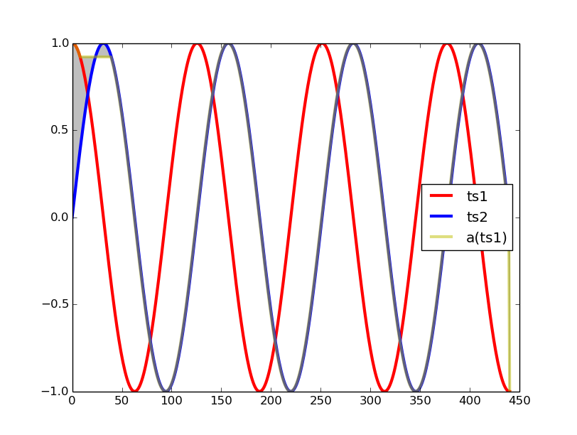
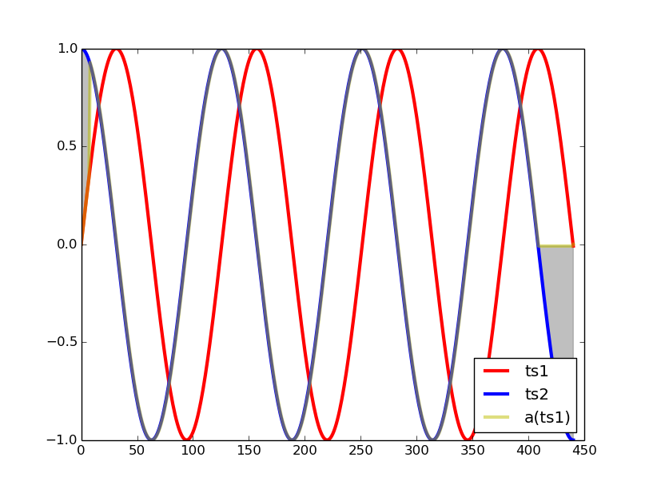
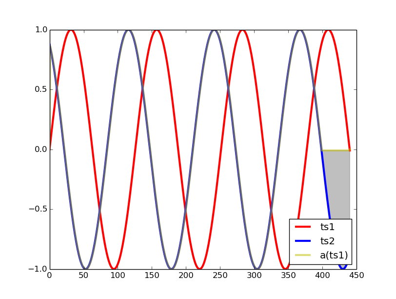
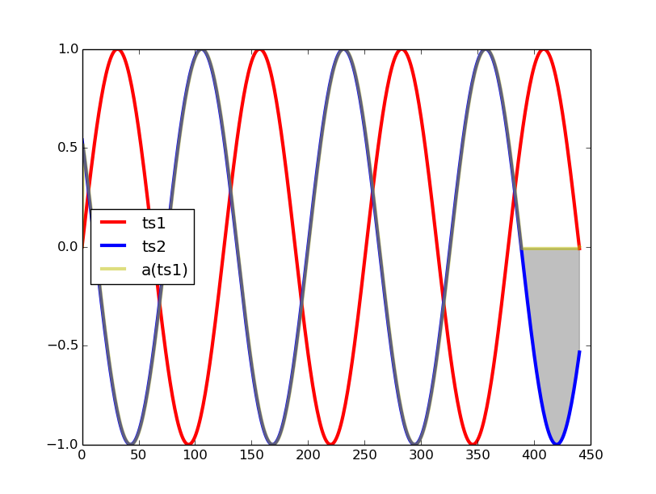
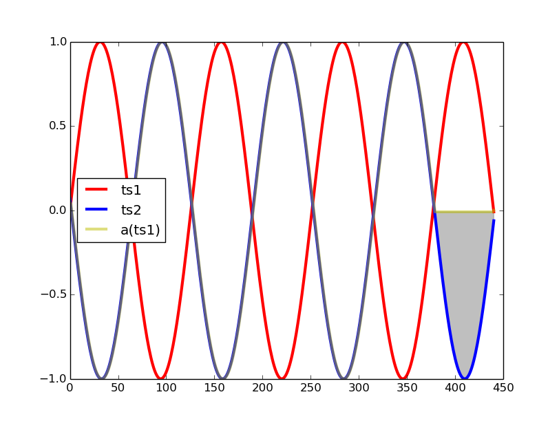
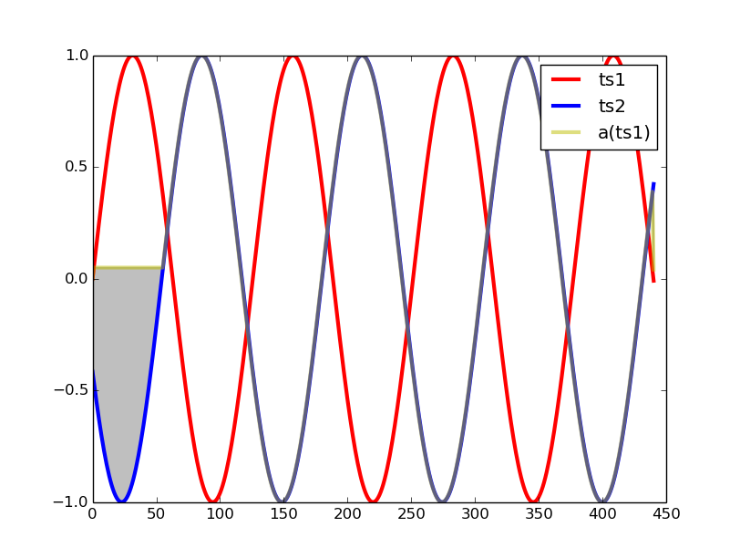
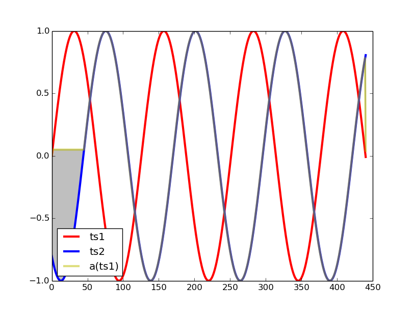
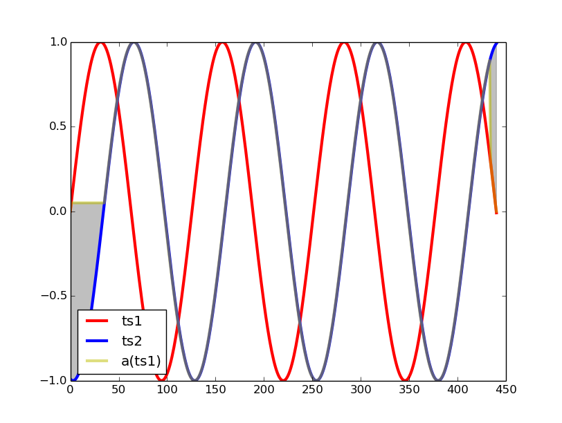

# Exercise 00

## Problem 0.1

1. The paper describes an approach to group similar experiences of an autonomous
roboter in order to be able to handle similar experiences in the future better,
either by predicting the outcome of an event, being able to generate better
plans, or act appropriately. The events in question are time series of sensor
data from the Pioneer 2 rover. The general method is to cluster similar time
series and extract a prototype from them.

    The first problem that arose was to have a similarity metric between two
events. Because the events are time series, some effects make the usual methods
of similarity non applicable. For instance, the roboter may climb the same hill
two times, one time considerable slower. Althought it is a very similar
experience a metric such as the area between the curves would deliver a great
dissimilarity. Thus, DTW was used to avoid this problem. DTW tries to find a
morphing of the time axis such that the area between two curves (or time series)
is minimized. This was done for every pair of experience, and the resulting
dataset grouped with a grouping algorithm.

    The results were very promising, with a minimum compliance rate of 82%. A
problem was detected with the clustering algorithm, which grouped too
agressively. When measures against this problem were taken, compliance rate
generally went up (at least 92%), only for vision problems the compliance rate
went down. This was because the DTW algorithm deleted important information by
chosing warpings that minizimed the area between the curves but at the same time
removed important information.

2. The applications given in the paper are financial markets, where the future
course of a stock may be estimated based on the course over the last days and
learned experience prototypes, medical monitors, where the medical condition of
the patient may be predicted based on the data from the past (e.g. if there are
some irregularities during the last day in the heart rate monitor the patient
may be in risk of heart attack) and weather observing satellites which may again
predict weather phenomena (like when Il Nino starts for example).

3. The described setting is a Mars-Rover. It is very different to predict which
situations might arise on a different planet, which environment the rover might
roll into. Thus it is desirable for the robot to be able to classify and react
to changing situations on its own, without supervision.

4. The additional information would have to be a testing set of data which is
not given the robot, and a classification of the situations made by hand. The
classification was already generated by the team in the form of a grouping of
events made by hand, but it was not used for training (only for evaluation). The
robot then would have the information about this classification and could search
for patterns in the datapoints appended to a class. Why unsupervised learning is
preferable in this situation is described above.

5. Because the events are time series, some effects make the usual methods of
similarity non applicable. For instance, the roboter may climb the same hill two
times, one time considerable slower. Althought it is a very similar experience a
metric such as the area between the curves would deliver a great dissimilarity.
Thus, DTW was used to avoid this problem. DTW tries to find a morphing of the
time axis such that the area between two curves (or time series) is minimized.

## Problem 0.2

    import numpy as n
    import dtw as d
    
    dist = (lambda x, y: n.linalg.norm(x-y))
    x_cos = n.atleast_2d(n.cos(n.arange(0,22.05,0.05)))
    x_sin = n.atleast_2d(n.sin(n.arange(0,22.05,0.05)))
    
    align = d.dynamic_time_warping(x_cos, x_sin, dist)[1]
    
    d.plot_alignment(x_cos, x_sin, align)

### Graph

### Explanation
In the beginning we see some gray area. This is because our signal is not a
perfect sinus and cosinus but has an beginning and an end, where the algorithm
can't fit them perfectly. However, after this initial problem the two signals
could be overlapped perfectly, with no grey area between them. This is because
the sine and the cosine are signals that have the same shape, only moved by a
linear factor, something the DTW Algorithm can detect perfectly.

    import numpy as n
    import dtw as d
    
    dist = (lambda x, y: n.linalg.norm(x-y))
    x = n.arange(0,22.05,0.05);
    x_sin = n.atleast_2d(n.sin(x))
    
    for i in n.arange(0, 3.1415, 0.5):
        x_new = x + i
        x_cos = n.atleast_2d(n.cos(x_new))
        align = d.dynamic_time_warping(x_sin, x_cos, dist)[1]
        d.plot_alignment(x_sin, x_cos, align)

### Graphs

### Explanation

As we can see, the result is almost the same as before. The difference lies only
in the beginning, were the algorithm can't fit our signals perfectly, and
produces some errors. The rest is as perfect as before, because the cosine
doesn't change it's shape just because we add a bit to its input.
